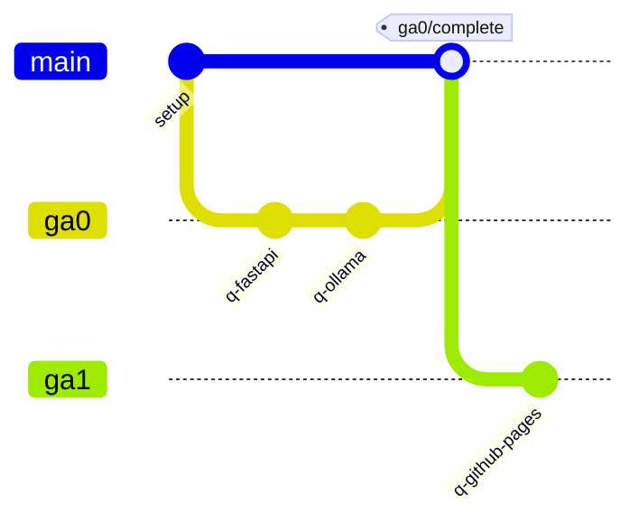

# Branches, commits, tags

## Branches



| Branch | Holds | Starts from | Merges into |
|--------|-------|-------------|-------------|
| `init` | the workflow only | n/a | `main` |
| `ga0` … `ga8`, `project-p1`, `roe` | one section each | `init` | `main`, when complete |
| `<section>-revisit` | late fixes | `init` | `main` |
| `main` | everything | n/a | n/a |

- Sections never start from `main`, so nothing leaks between them.
- Merge with `--no-ff` so per-question commits stay visible. Never rebase pushed work.

## Commits

One commit per question, made only when it reaches a final status.

| Type | When |
|------|------|
| `solved` | answer verified and saved on the exam page |
| `set-aside` | parked on purpose |
| `cant-approach` | attempted but blocked |
| `setup` | repo-level change, on `init` |
| `merge` | section merged into `main` |

```text
solved(ga0/q-fastapi): GET /api endpoint deployed on Vercel

Approach: FastAPI on Vercel serverless; see final.md

Co-Authored-By: Claude Opus 5.5 <noreply@anthropic.com>
```

Every LLM or agent used on a question gets its own `Co-Authored-By` trailer.

## Tags

Annotated, never moved or deleted.

| Event | Tag |
|-------|-----|
| Question commit | `ga0/q-fastapi/solved` |
| Section merged | `ga0/complete` |
| Revisit merged | `ga0/revisit-1` |
| Setup change | `setup/<name>` |
