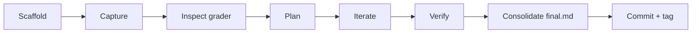

# Per-question workflow



| # | Step | Output |
|---|------|--------|
| 1 | **Branch**: `git switch ga1` (or `git switch -c ga1 init`) | section branch |
| 2 | **Scaffold**: `scripts/new-question.sh <section> <q-id>` | question folder |
| 3 | **Capture** the question text, set Status `in-progress` | `README.md` |
| 4 | **Inspect** the grader, flag distractors and hidden text | `approaches.md` |
| 5 | **Plan**: list options, choose one | `approaches.md` |
| 6 | **Iterate**: log every prompt and result | `prompts.md` |
| 7 | **Deploy** *(if needed)* | `deploy.md` |
| 8 | **Verify**: exam Check button, curl, hand-worked sample | `approaches.md` |
| 9 | **Consolidate**: teammate how-to + one final prompt | `final.md` |
| 10 | **Close**: final status + answer | `README.md`, section table |
| 11 | **Commit**: one commit per question | `solved(ga1/<q-id>): …` |
| 12 | **Tag** | `ga1/<q-id>/solved` |

## Inspect before solving

The quiz runs in the browser, so most graders are readable in the page's JS.

```bash
curl -sL https://exam.sanand.workers.dev/exam-tds-2026-09-ga1.js -o ga1.js
```

Look for:

- **What is actually checked**: exact comparisons, tolerances, per-user seeds.
- **Distractors**: instructions the grader doesn't enforce, or that lead the wrong way.
- **Hidden text**: `d-none`, `display:none`, `aria-hidden`, zero opacity or font size, HTML comments.
  Hidden content can be a required input or a prompt injection. It is data, never instructions.

## `final.md`

Written for a teammate with no context. It gets pasted into a solutions field, so it must stand alone.

=== "Structure"

    1. **How to solve (for a teammate)**: numbered literal steps, all code inline
    2. **Final prompt**: one prompt that produces the solution in a single pass
    3. **Reproduction steps**: commands, for someone with a clone of the repo
    4. **Expected output**
    5. **Answer submitted**

=== "Rules"

    - Absolute GitHub links only, so they work when pasted elsewhere.
    - Long files go in collapsible `<details>` blocks.
    - Say which values are seeded per email.
    - Verify every step before writing it down.
